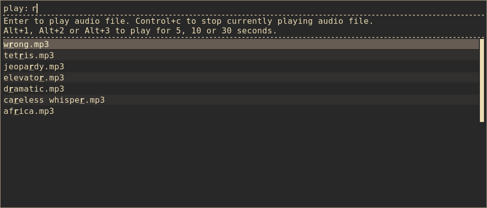

# rofi-soundboard

A bash script to select and play sound clips using
[rofi](https://github.com/DaveDavenport/rofi)

## Features
- Select from all your sound clips with minimum keystrokes
- Play for 5s, 10s, 30s or until stopped
- Perfect way to annoy colleagues
- Plays without UI to not raise suspicion

## Config
Set `SDN_HOME` to a folder containing sound clips.

Default key binding:
- "Ctrl+c": stop
- "Alt+1": play selection for 5s
- "Alt+2": play selection for 10s
- "Alt+3": play selection for 30s
- "Return": play selection until stopped (or end)

## Requirements
- [rofi](https://github.com/DaveDavenport/rofi)
- [vlc](https://github.com/videolan/vlc)
- cool and annoying sound clips!
